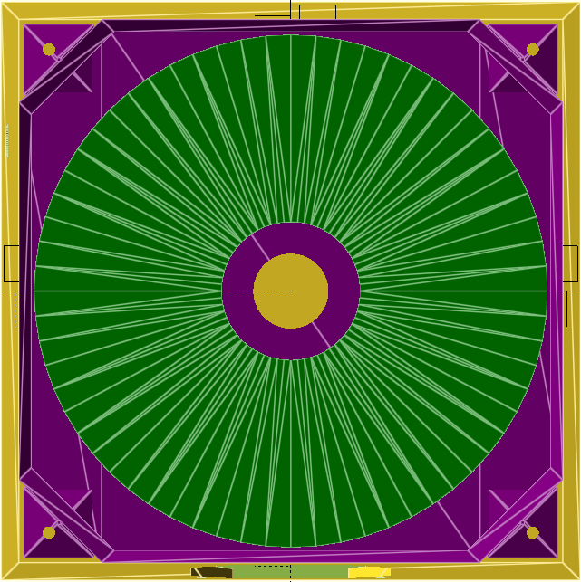

Firmware for the Dankdryer, the world's best filament dryer.

Intended for use with an ESP32-S3-WROOM-1.

More info at [dankwiki](https://nick-black.com/dankwiki/index.php/Dankdryer).

# Printing and BOM

There are eight pieces to print:
 * the lower (cool) chamber
 * the upper (hot) chamber
 * the top
 * the center column
 * the air shield
 * the worm gear
 * the shaft
 * the gear

Use heat-resistant filaments. My lower chamber is polycarbonate, and my upper
chamber is Bambu PAHT-CF.

Additionally, you'll need a ceramic heating element, a buck converter, an AC
adapter, an ESP32-S3 devkit, a motor, a TB6612FNG motor controller, a 5kg load
cell and its HX711 controller, two NF-A8 80mm fans, two Molex 4-pin fan
connectors, and hookup wire.

## Assembling the lower chamber

The worm gear is attached to a [Geartisan 12V motor](https://www.amazon.com/dp/B071XCX778).
The motor, AC adapter, buck converter, load cell, and perfboard are mounted
into the cool chamber using screws.

## Assembling the central column

The center column is mounted onto the load cell. The
shield is then mounted into the cool chamber, followed by the hot chamber.

# Renderings

View from the top with spool present, top not present.

