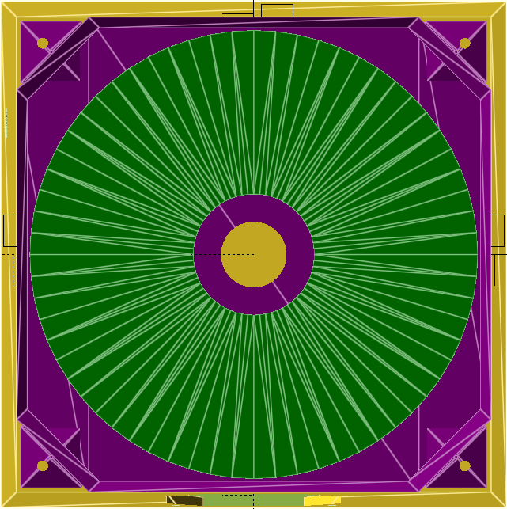

ESP32-S3 firmware and SCAD sources for the Dankdryer, the world's best filament dryer.
 
 a nick black joint

# Features

* Temperatures up to at least 150℃  when printed with proper materials.
  * Such temperatures are appropriate (necessary) for certain engineering filaments.
  * A high-temperature spool is required at these temperatures.
* Accurate weight sensing throughout to determine how much water has been exorcised.
  * Post contextless deltas to reddit in the heat of dumbass arguments! DATA, bitch!
* Slow rotation like delicious savory meat.
* Equal heating of all the spool's filament.
* Reads RFID tags and applies correct config.
* Control and reporting over MQTT via WiFi.
* OTA firmware upgrades.
* Isolated hot and cool chambers, with most active equipment in the cool chamber.
* Humidity sensing and temperature sensing in both chambers.
* Entirely open source.

More info at [dankwiki](https://nick-black.com/dankwiki/index.php/Dankdryer).

# Dependencies

The project is built with GNU Make.
Running `make` in the toplevel will attempt to build firmware and STLs.
Building the firmware requires the `esp-idf` library and a configured
ESP-IDF environment (i.e. the various `IDF_*` environment variables
must be set), along with CMake. `idf.py` ought be in your `$PATH`,
and work when invoked.

A network configuration file must be created and populated at
`esp32-s3/dankdryer/dryer-network.h`.

## Firmware
* [esp-idf](https://github.com/espressif/esp-idf) 5.3+
* [CMake](https://gitlab.kitware.com/cmake/cmake) 3.16+

## 3D models
* OpenSCAD 2024.10+

I use
[BOSL2](https://github.com/BelfrySCAD/BOSL2) and
Jörg Janssen's [gears.scad](https://github.com/chrisspen/gears), but
they are included as submodules.

# Construction

The following pieces are printed:
 * lower (cool) chamber
 * upper (hot) chamber
 * top
 * worm gear
 * lower coupling (load cell to bearing)
 * platform
 * gear

Use heat-resistant filaments. My lower chamber is polycarbonate, and my upper
chamber is Bambu PAHT-CF. You obviously don't want to use a target temperature
within 10% of your material's heat deformation temperature.

# MQTT

MQTT is used to report status and to accept commands.

## Controls

* `NAME/control/tare`: tare using the last weight read
* `NAME/control/dry`: takes as argument a string "DRYS/TEMP", where DRYS and TEMP are unsigned integers
    specifying the number of seconds to dry, and the temperature to dry at. Any ongoing drying operation
    will be replaced with the newly specified one. Specifying zero for DRYS will cancel any ongoing
    drying operation.
* `NAME/control/lpwm`: takes as argument a hexadecimal number between 0 and 255, left-padded with zeroes
    so as to be exactly two digits, i.e. "00".."ff". Sets the lower fan's PWM.
* `NAME/control/upwm`: takes as argument a hexadecimal number between 0 and 255, left-padded with zeroes
    so as to be exactly two digits, i.e. "00".."ff". Sets the upper fan's PWM.

# Renderings

View from the top with spool present, top not present.

View from the top of the lower chamber by itself, with nothing mounted.

Combined OpenSCAD render for mating testing.

 

# Questions

* How does air flow? Let's get some visible air and test it.
* The ESP32-S3 has a MCPWM, a motor controller. Can we eliminate the TB6612FNG?
* Would we benefit from thermal insulation material in the hotbox?
* Ought we change our circuits to add protection or eliminate noise?
* Ought we replace the perfboard and its various breakouts with a custom PCB?
* Can we use a smaller (cheaper) motor / AC adapter?
