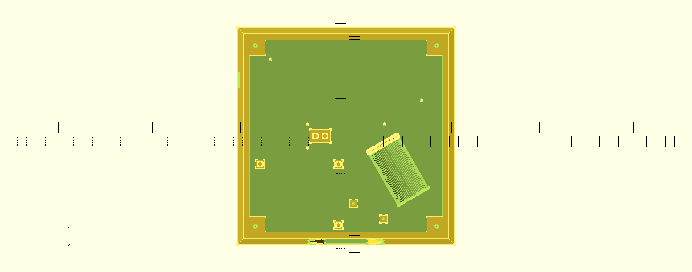

ESP32-S3 firmware and SCAD sources for the Dankdryer, the world's best filament dryer.

# Features

* Temperatures up to 150C when printed with proper materials.
* Accurate weight sensing throughout to determine how much water has been exorcised.
  * Post contextless deltas to reddit in the heat of dumbass arguments! DATA, bitch!
* Slow rotation like delicious savory meat.
* Equal heating of all the spool's filament.
* Control and reporting over MQTT via WiFi.
* Isolated hot and cool chambers, with most active equipment in the cool chamber.
* Humidity sensing and temperature sensing in both chambers.

More info at [dankwiki](https://nick-black.com/dankwiki/index.php/Dankdryer).

# Dependencies

The project is built with GNU Make.
Running `make` in the toplevel will attempt to build firmware and STLs.

A network configuration file must be created and populated at
`esp32-s3/dankdryer/dryer-network.h`.

## Firmware
* `arduino-cli` with `esp32:esp32:esp32s3` board support
* Rob Tillaart's [HX711](https://github.com/RobTillaart/HX711) 0.5.0+

## 3D models
* OpenSCAD 2021.01+
* Jörg Janssen's [gears.scad](https://github.com/chrisspen/gears) 2.2+
* [BOSL2](https://github.com/BelfrySCAD/BOSL2)

# Printing and BOM

There are eleven pieces to print:
 * the lower (cool) chamber
 * the upper (hot) chamber
 * the top
 * the air shield
 * the worm gear
 * the lower coupling (load cell to bearing)
 * the shaft (runs through bearing, gear, spacers, and platform)
 * the platform
 * the gear
 * the lower spacer
 * the upper spacer

Use heat-resistant filaments. My lower chamber is polycarbonate, and my upper
chamber is Bambu PAHT-CF. You obviously don't want to use a target temperature
within 10% of your material's heat deformation temperature.

Additionally, you'll need a ceramic heating element, a buck converter, an AC
adapter, an ESP32-S3 devkit, a [Geartisan 12V motor](https://www.amazon.com/dp/B071XCX778),
a TB6612FNG motor controller, a 5kg load cell and its HX711 controller, two
NF-A8 80mm fans, two Molex 4-pin fan connectors, a 608 bearing, a ~3A inline fuse,
and hookup wire.

## Preparing the AC cords

* Cut the female end off of a 16 AWG grounded NEMA 5-15 cable.
* Strip ~5cm down to the three insulated wires.
* Strip each wire down to ~1cm.
* Insert the live wire into the inline fuse and secure with heat shrink.
* Terminate each wire (fused live, neutral, and ground) with a ring or spade terminal + heatwrap.
* Prepare two wires of length ~20cm and AWG between 22 and 18.
  * Terminate one end of each wire with a ring or spade terminal + heatwrap.
  * Terminate the other end of each wire with a female quick disconnect terminal + heatwrap.

## Assembling the lower chamber

* Place the motor atop the motor stand, and secure it with six screws.
* Attach the worm gear to the rotor.
* Secure the AC adapter with two screws.
* Run the AC cable through the circular hole, and the two prepared wires through the wire channel along the floor.
  * Connect the AC cable's live wire and one of the other wires at the AC adapter's 'L'(ive) screw terminal.
  * Connect the AC cable's neutral wire and one of the other wires at the AC adapter's 'N'(eutral) screw termninal.
  * Connect the AC cable's ground wire to the AC adapter's ground screw terminal.
* Secure the buck converter with two screws.
* Secure the load cell with two screws.
* Secure the perfboard with two screws.
* Secure a fan to the outside with four screws, blowing in.

## Assembling the central column

* The lower coupling is mounted onto the load cell with two screws.
* Insert the shaft into the bearing.
* Push the lower spacer down atop the bearing.
* Push the gear down atop the lower spacer.
* Push the upper spacer down atop the gear.
  * There will be space left on the shaft.
* **Gently** place the bearing into the recess at the top of the lower coupling.
* Secure the air shield with three screws.

## Assembling the top chamber

* Secure a fan to the outside with four screws, blowing out.
* Secure the heating element with four screws.
* Terminate both wires of the heating element with male quick disconnect terminals.
* Connect the heater wires and the prepared wires, using the circular hole in the top chamber's floor.
* Secure the top chamber with four screws.
* **Gently** place the platform onto the top of the shaft.

# Renderings

View from the top with spool present, top not present.

View from the top of the lower chamber by itself, with nothing mounted.

# Questions

* How does air flow? Let's get some visible air and test it.
* The ESP32-S3 has a MCPWM, a motor controller. Can we eliminate the TB6612FNG?
* Would we benefit from thermal insulation material in the hotbox?
* Can we replace the lower 80x80mm fan with e.g. 4x 40x40mm fans, and reduce height?
