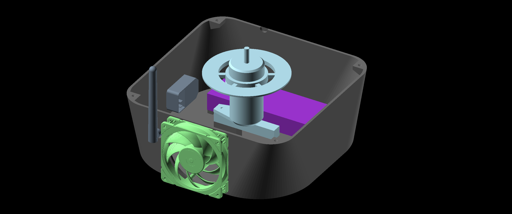

ESP32-S3 firmware and SCAD sources for the Dankdryer, the world's best filament dryer.
 
 a nick black joint

# Features

* Temperatures up to at least 150℃  when printed with proper materials.
  * Such temperatures are appropriate (necessary) for certain engineering filaments.
  * A high-temperature spool is required at these temperatures.
* Accurate weight sensing throughout to determine how much water has been exorcised.
  * Post contextless deltas to reddit in the heat of dumbass arguments! DATA, bitch!
* Slow rotation like delicious savory meat.
* Equal heating of all the spool's filament.
* Reads RFID tags and applies correct config.
* Control and reporting over MQTT via WiFi.
* OTA firmware upgrades.
* Isolated hot and cool chambers, with most active equipment in the cool chamber.
* Humidity sensing and temperature sensing in both chambers.
* Entirely open source.

More info at [dankwiki](https://nick-black.com/dankwiki/index.php/Dankdryer).

# Dependencies

The project is built with GNU Make.
Running `make` in the toplevel will attempt to build firmware and STLs.
Building the firmware requires the `esp-idf` library and a configured
ESP-IDF environment (i.e. the various `IDF_*` environment variables
must be set), along with CMake. `idf.py` ought be in your `$PATH`,
and work when invoked.

A network configuration file must be created and populated at
`esp32-s3/dankdryer/dryer-network.h`.

## Firmware
* [esp-idf](https://github.com/espressif/esp-idf) 5.3+
* [CMake](https://gitlab.kitware.com/cmake/cmake) 3.16+

## 3D models
* OpenSCAD 2024.10+

I use
[BOSL2](https://github.com/BelfrySCAD/BOSL2), which
is included as a submodule.

# Construction / BOM

The device requires approximately 500g of high-temperature filament (PC,
PAHT-CF, etc.) to print. The exact amount of filament will depend on
material and print settings. Six pieces are printed:

 * Hot chamber
 * Cool chamber
 * Motor sheath
 * Sheath coupling
 * Spool platform
 * Top

The hot and cool chamber dominate filament consumption, though
the top is non-negligible. At consumer prices, bought in half-kilogram
and kilogram units, this represents anywhere from roughly $15 (Polymaker
PolyLite polycarbonate) to $40 (Polymaker Fiberon PA6-CF20).

### Hot chamber

* [230C 110V ceramic heating element](https://www.amazon.com/dp/B0BXNPXXYW)
* High-temperature thermal sensor (was using LM35 but will probably switch)
* [KSD301 150C NC thermal control](https://www.amazon.com/Rebower-Thermostat-Temperature-Microwave-Refrigerators/dp/B0BLL75326)
* [Hall sensor](https://www.digikey.com/en/products/detail/diodes-incorporated/AH3712Q-P-B/19920700)
* 1µF unpolarized capacitor
* 68Ω resistor
* 1x4 screw terminal
* Small perf board

I'll probably make a dinky little PCB to replace the perf board here.
We need a temperature sensor and hall effect sensor (and obviously the
heating circuit) in the hot box; nothing else ought be there.

### Cool chamber

* [Greartisan 5RPM 12V DC motor](https://www.amazon.com/dp/B072N867G3/)
* [NEMA plug + rocker switch](https://www.amazon.com/ASHATA-Rocker-Switch-Adapter-Printer/dp/B085VSS1F2)
* [160W 12V AC adapter](https://www.amazon.com/gp/product/B0D7GMVK2F)
* 2-to-4 cable splitter
* Custom PCB (fabrication cost is negligible; see components below)

Of these, we don't need nearly so powerful an AC adapter, and we ought
be able to use a cheapter motor.

#### PCB components

Generated via Kicad:

|Id |Designator |Footprint                         |Quantity|Designation     |
|---|-----------|----------------------------------|--------|----------------|
|1  |U1         |ESP32-S3-DevKitC                  |1       |ESP32-S3-DevKitC|
|2  |C7,C3      |C_0805_2012Metric                 |2       |.1n             |
|3  |R8,R5      |R_0805_2012Metric                 |2       |3.3k            |
|4  |U3         |SOT-89-3                          |1       |HT7550-1-SOT89  |
|5  |J3         |FanPinHeader_1x04_P2.54mm_Vertical|1       |lower fan       |
|6  |J1         |BarrelJack_Wuerth_6941xx301002    |1       |Barreljack      |
|7  |OC1        |SMDIP-6_W9.53mm                   |1       |MOC3063SM       |
|8  |J5         |TerminalBlock_bornier-5_P5.08mm   |1       |To microboard   |
|9  |R14        |R_0805_2012Metric                 |1       |330             |
|10 |J4         |FanPinHeader_1x04_P2.54mm_Vertical|1       |upper fan       |
|11 |L1         |L_0805_2012Metric                 |1       |2.2u            |
|12 |C1,C5,C2,C4|C_0805_2012Metric                 |4       |10u             |
|13 |UHX1       |Sparkfun HX711 SEN-13879          |1       |SEN13879        |
|14 |R6,R4      |R_0805_2012Metric                 |2       |680             |
|15 |R15        |R_0805_2012Metric                 |1       |100             |
|16 |R3         |R_0805_2012Metric                 |1       |360             |
|17 |J2         |TerminalBlock_bornier-2_P5.08mm   |1       |heater          |
|18 |U2         |TPS62162                          |1       |TPS62162DSG     |
|19 |R10        |R_0805_2012Metric                 |1       |220             |
|20 |Q2         |TO-252-2                          |1       |BT136S-800E     |
|21 |Q1         |SOT-323_SC-70                     |1       |SSM3K127TU      |

# MQTT

MQTT is used to report status and to accept commands.

## Controls

* `NAME/control/tare`: tare using the last weight read
* `NAME/control/dry`: takes as argument a string "DRYS/TEMP", where DRYS and TEMP are unsigned integers
    specifying the number of seconds to dry, and the temperature to dry at. Any ongoing drying operation
    will be replaced with the newly specified one. Specifying zero for DRYS will cancel any ongoing
    drying operation.
* `NAME/control/lpwm`: takes as argument a hexadecimal number between 0 and 255, left-padded with zeroes
    so as to be exactly two digits, i.e. "00".."ff". Sets the lower fan's PWM.
* `NAME/control/upwm`: takes as argument a hexadecimal number between 0 and 255, left-padded with zeroes
    so as to be exactly two digits, i.e. "00".."ff". Sets the upper fan's PWM.
* `NAME/control/factoryreset`: takes no arguments. Blanks the persistent storage, disables the motor
    and heater, and reboots.

# Renderings

View from the top:

View from the top of the lower chamber by itself, with the AC
adapter and motor assembly present.

Combined OpenSCAD render for mating testing.

 

# Questions

* How does air flow? Let's get some visible air and test it.
* Would we benefit from thermal insulation material in the hotbox?
* Can we use a smaller (cheaper) motor / AC adapter?
